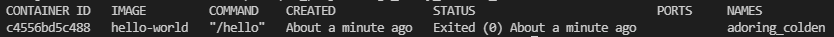

# Docker

- Container 기반 오픈소스 가상화 플랫폼이다.
- 다양한 프로그램의 실행환경을 Container로 추상화 하여 동일한 interface로 프로그램의 배포, 관리를 해준다.
- Docker image를 실행한 상태로, application의 종속성과 application을 격리된 공간에서 동작시키도록 한다.

```
Container
각각 S/W의 실행환경을 독립적으로 실행하도록 하는 OS수준의 격리
```

### Docker 설치

- Window(pro) 환경에서 도커를 사용하기 위해 ubuntu 설치가 필요함
- ubuntu는 Microsoft store에서 설치가 가능하다.
- [Docker 공식 홈페이지](https://www.docker.com/get-started)에서 Docker를 설치한다.
- Docker Desktop을 이용하여 도커를 편하게 다룰 수 있다.[Docker Desktop](https://www.docker.com/products/docker-desktop)
- Docker Deskotop은 2022년 2월 기업(250명 이상) 대상으로는 유료화가 된다고 한다. 개인은 무료로 사용할 수 있다.

### ubuntu에서 Docker 설치

- ubuntu에서 Docker를 사용하려면 Docker 관련 프로그램 설치가 필요하다.

1. 저장소 설정

- HTTPS를 통해 repository를 사용할 수 있도록 apt패키지를 업데이트하고 설치한다.

```
sudo apt update
sudo apt install ca-certificates curl gnupg lsb-release
```

- Docker의 공식 GPG키를 추가한다.

```
curl -fsSL https://download.docker.com/linux/ubuntu/gpg | sudo gpg --dearmor -o /usr/share/keyrings/docker-archive-keyring.gpg
```

- 안정적인 저장소 설정

```
echo \
  "deb [arch=$(dpkg --print-architecture) signed-by=/usr/share/keyrings/docker-archive-keyring.gpg] https://download.docker.com/linux/ubuntu \
  $(lsb_release -cs) stable" | sudo tee /etc/apt/sources.list.d/docker.list > /dev/null
```

2. Docker engine을 설치한다.

```
sudo apt update
sudo apt install docker-ce docker-ce-cli containerd.io
```

3. Docker를 실행한다.

```
service docker start restart
service docker status
```

- 실행하면 _Docker is running_ 문구가 뜬다.

### Docker image

- Docker에서 서비스 운영에 필요한 서버 프로그램, 소스코드 및 라이브러리, 컴파일된 실행 파일을 묶는 형태를 docker image라고 한다.
- 특정 프로세스를 실행하기 위한 모든 파일과 설정값을 지니며, 더 이상의 의존성 파일을 컴파일하거나 설치할 필요가 없는 상태이다.
- image는 immutable이다.
- 하나의 image는 여러 container를 생성할 수 있고, container가 삭제되더라도, 이미지는 변하지 않고 그대로 남아있다.
- Docker image들은 DockerHub를 통해 버전 관리 및 배포가 가능하다. (git과 유사함)
- Dockerfile로 이미지를 만든다. Dockerfile에는 소스와 함께 의존성 패키지 등 사용했던 설정 파일을 버전관리가 쉽도록 작성된다.

### Docker image 작업

```
docker run hello-world
```

- 위 명령어를 실행하면 Local에서 해당 이미지를 찾아보고 없으면 기본 repository(Docker Hub)에서 이미지를 다운로드 한다.
- docker container를 확인하기 위해 아래 명령어를 실행한다.

```
docker container ls --all
```

- docker container목록을 확인할 수 있다.
  

- container를 삭제하려면 container id로 삭제하는 방법이 있고, container 이름으로 삭제하는 방법이 있다.

```
docker rm <CONTAINER_ID>
docker rm <CONTAINER_NAME>
```

- Docker image를 확인하기 위한 명령어이다.

```
docker images
```

- Docker image를 지우기 위한 명령어이다.

```
docker rmi <REPOSITORY>
```

- 만약 실행중인 이미지라면 -f 옵션으로 강제 삭제할 수 있다.

```
docker rmi -f <REPOSITORY>
```

- ubuntu라는 docker container를 실행시켜본다면 아래의 명령어를 실행한다. (-i, -t 조합은 container에 대한 대화식 shell 접근을 제공함)

```
docker run -it ubuntu
```

### Dockerfile

- Docker image를 생성하기위한 파일이다.

- Dockerfile 이라는 파일에 내용을 작성한다.

- Dockerfile의 내용으로 image를 build하려면 아래 명령어를 실행한다.

```
docker build -t <docker image name>
```

[작성방법-공식문서 참조](https://docs.docker.com/develop/develop-images/dockerfile_best-practices/)

### Docker compose

- Docker-compose는 복수의 container를 실행시키는 Docker application이 정의를 하기 위한 툴이다.

- yml파일을 사용하여 compose를 구성한다.

- docker-compose.yml을 실행하기 위한 명령어

1. Run docker-compose on background

```
docker-compose up -d
```

<table>
  <tr>
    <td><strong>Option</strong></td>
    <td><strong>Function</strong></td>
  </tr>
  <tr>
    <td>-d</td>
    <td>Run on background</td>
  </tr>
  <tr>
    <td>--no-deps</td>
    <td>Don't run link service</td>
  </tr>
  <tr>
    <td>--build</td>
    <td>Build image</td>
  </tr>
  <tr>
    <td>--t</td>
    <td>Setting timeout (default 10s)</td>
  </tr>
</table>

2. Confirm running container

```
docker-compose ps
```

3. Display containers logs

```
docker-compose logs
```

4. Run specific order to run container

```
docker-compose run <service name> <option>
```

5. start/stop/pause/unpause/restart service

```
docker-compose start
docker-compose stop
docker-compose pause
docker-compose unpause
docker-compose restart
```

6. stop and delete

```
docker-compose down
```

7.  Remove created container all-togather

```
docker-compose rm
```

8. Compulsion stop fo running conainer

```
docker-compose kill
```

9. Confirm service's info

```
docker-compose port
```

[작성방법-공식문서 참조](https://docs.docker.com/compose/compose-file/)
